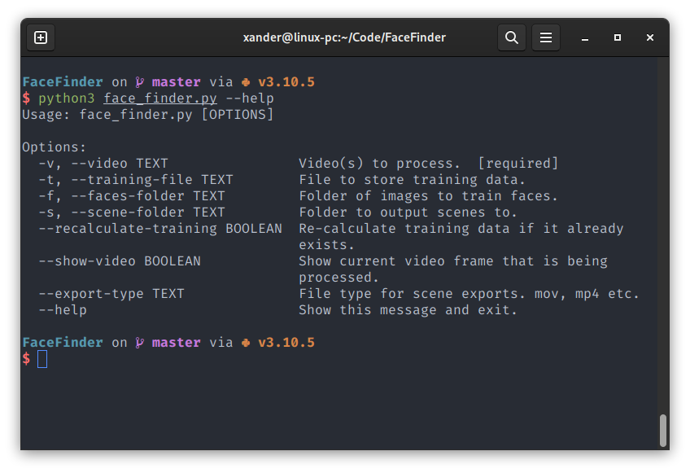

# Face Finder
This script allows you quickly scan large video files for faces
and export them into smaller clips.

### How to use
1. Clone and enter the repository with `git clone https://github.com/isXander/FaceFinder.git && cd FaceFinder`
2. Make sure you have python3 and pip installed.
3. Install all requirements with `pip install -r requirements.txt`
4. Run the script with `python3 face_finder.py --help` to find instruction on how to use.

### Screenshots
*Data displayed in examples is not real!*

